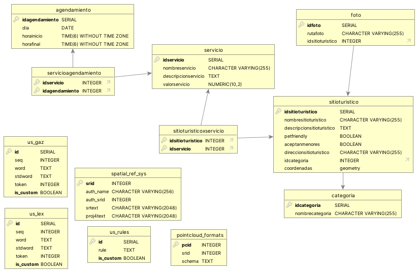

# SIG Turístico Manizales — Base de Datos

Proyecto del **Semillero SIG** de la Facultad de Ciencias e Ingeniería, Universidad de Manizales: _“SIG turístico para la ciudad de Manizales con realidad aumentada”_. Este repositorio contiene la base de datos espacial (PostgreSQL + PostGIS) que respalda el catálogo de sitios, servicios y vistas temáticas usados por el proyecto de RA.

## Contenido del repositorio
- `backupDBV4.sql`: volcado completo de la base de datos (PostgreSQL 15.13) con extensiones geoespaciales y datos iniciales.
- `baseDatosSitios.csv` / `baseDatosSitios.xlsx`: dataset tabular original de sitios turísticos con coordenadas (WGS84).
- `dbSigTuristico.jpg`: diagrama entidad–relación utilizado para consolidar el modelo.



## Requisitos
- PostgreSQL 15 o superior.
- Extensiones espaciales y de soporte instaladas en la base: `postgis`, `postgis_topology`, `postgis_raster`, `postgis_sfcgal`, `postgis_tiger_geocoder`, `address_standardizer`, `address_standardizer_data_us`, `pgrouting`, `h3`, `h3_postgis`, `pointcloud`, `pointcloud_postgis`, `ogr_fdw`. El volcado las crea automáticamente con `CREATE EXTENSION IF NOT EXISTS`, pero deben estar disponibles en el servidor.

## Restauración rápida
1) Crear una base vacía:
```bash
createdb sig_turistico_manizales
```
2) Restaurar el volcado:
```bash
psql -d sig_turistico_manizales -f backupDBV4.sql
```
3) Verificar que la proyección espacial sea la esperada:
```sql
SELECT Find_SRID('public','sitioturistico','coordenadas'); -- debe devolver 4326
```

## Modelo de datos principal
- `categoria`: catálogo (templos, alojamientos, monumentos, parques, museos, cafés).
- `sitioturistico`: sitio con nombre, descripción, flags `petfriendly` y `aceptanmenores`, dirección y geometría `Point` SRID 4326.
- `servicio`: servicios ofrecidos (texto y costo).
- `agendamiento`: ventana de fecha y horas para reservar.
- `servicioagendamiento`: relación servicio–agenda.
- `sitioturisticoxservicio`: servicios disponibles por sitio.
- `foto`: rutas de imagen por sitio.
- Vistas temáticas (`vista_alojamientos`, `vista_cafes`, `vista_monumentos`, `vista_museos`, `vista_parques`, `vista_templos`) filtran `sitioturistico` según la categoría.

## Datos cargados
El volcado incluye 6 categorías y 80+ registros de sitios turísticos de Manizales (coordenadas en WGS84, precisión a ~1e-6). Las secuencias quedan alineadas al último `id` para continuar insertando sin colisiones.

## Uso básico
- Listar cafés con coordenadas:
```sql
SELECT nombresitioturistico, direccionsitioturistico, ST_AsText(coordenadas)
FROM vista_cafes
ORDER BY nombresitioturistico;
```
- Insertar un nuevo sitio (ejemplo):
```sql
INSERT INTO sitioturistico (nombresitioturistico, descripcionsitioturistico, petfriendly,
                            aceptanmenores, direccionsitioturistico, idcategoria, coordenadas)
VALUES ('Nuevo Mirador', 'Mirador comunitario', TRUE, TRUE, 'Vereda El Paraíso',
        4, ST_SetSRID(ST_MakePoint(-75.50, 5.05), 4326));
```

## Colaboradores
- **Juan Diego Giraldo Ospina** — [GitHub @JuanDiego500-sys](https://github.com/JuanDiego500-sys)

